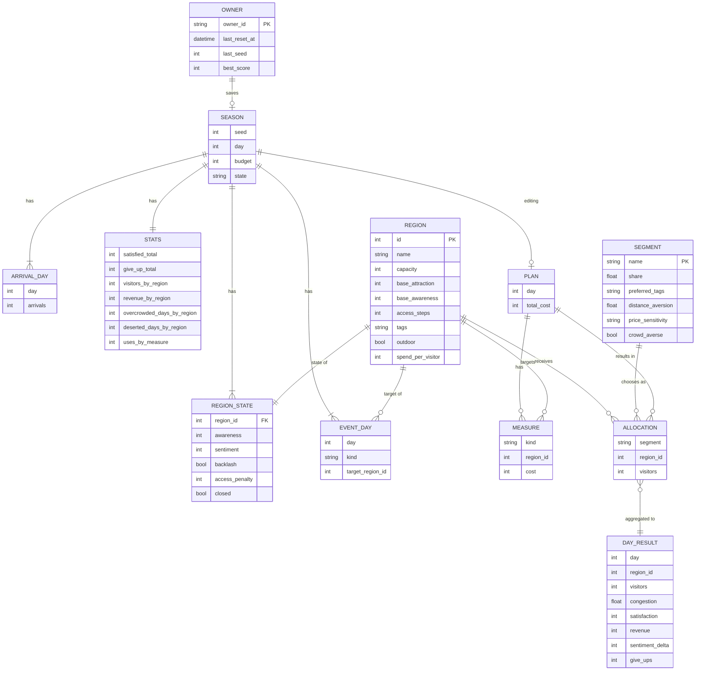
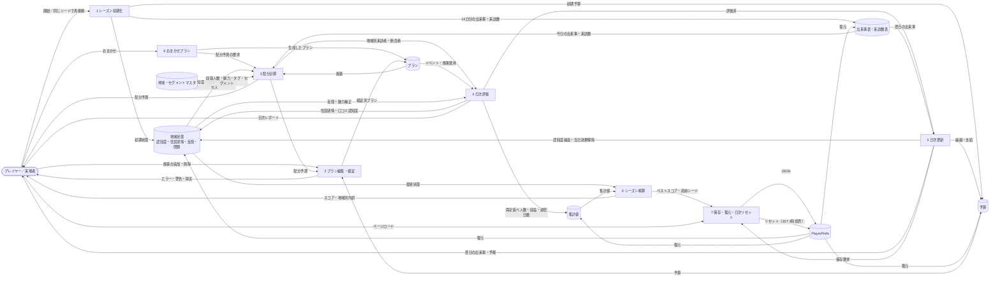
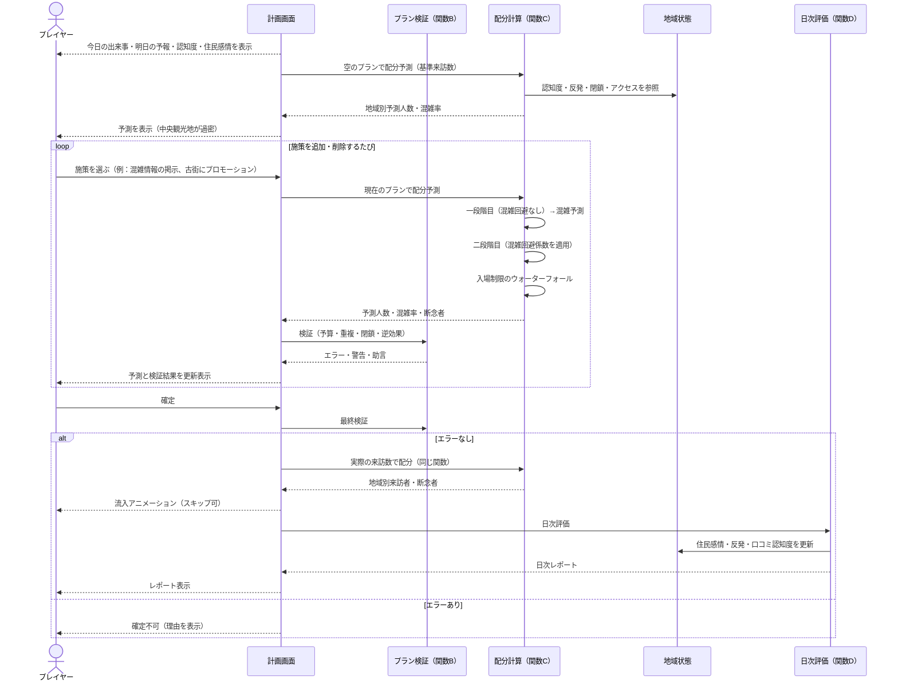
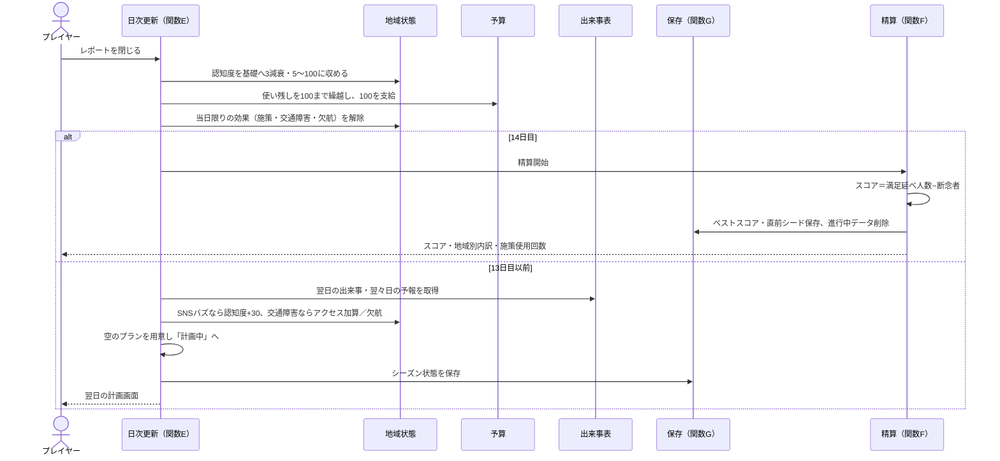
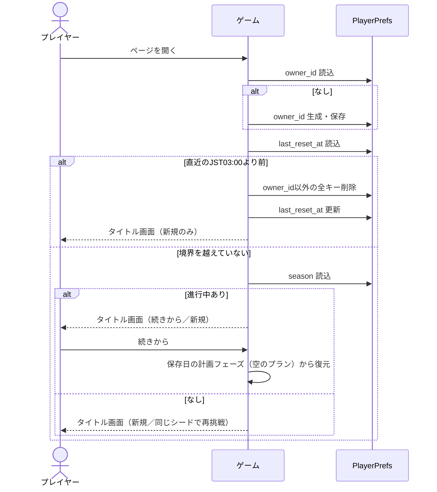
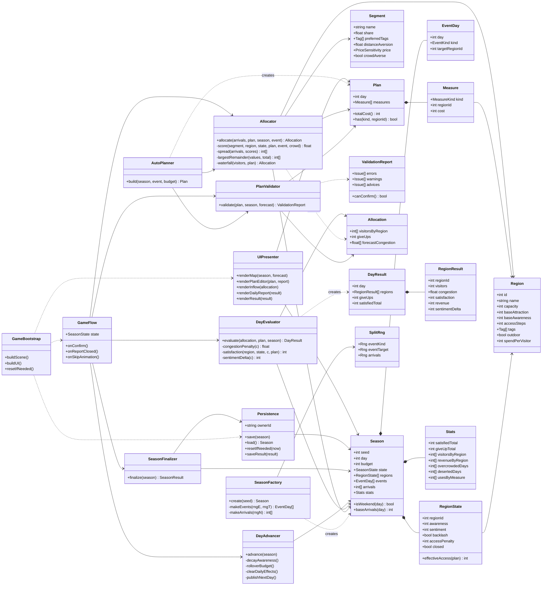
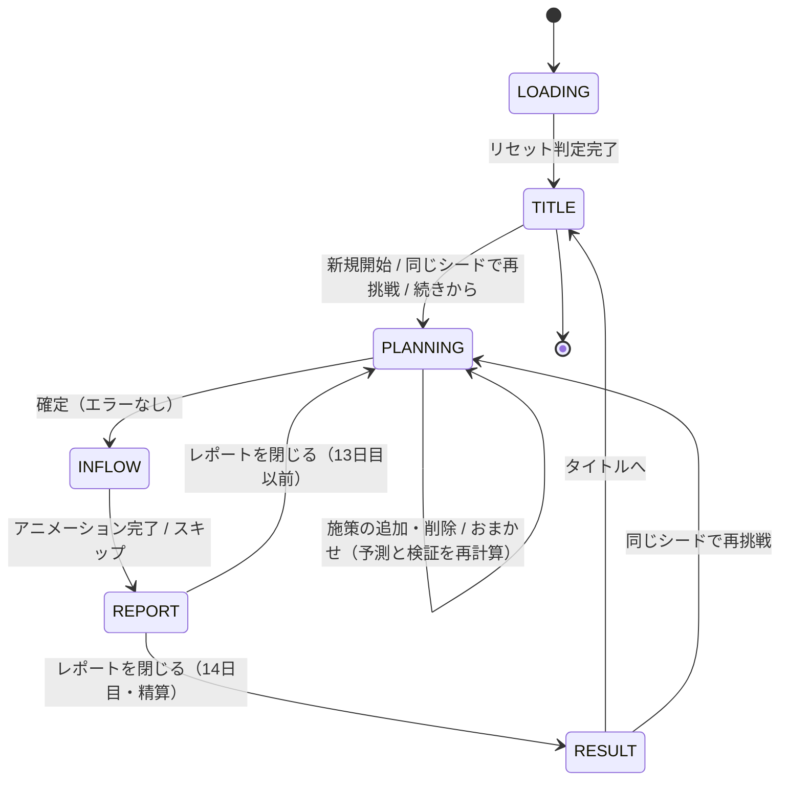
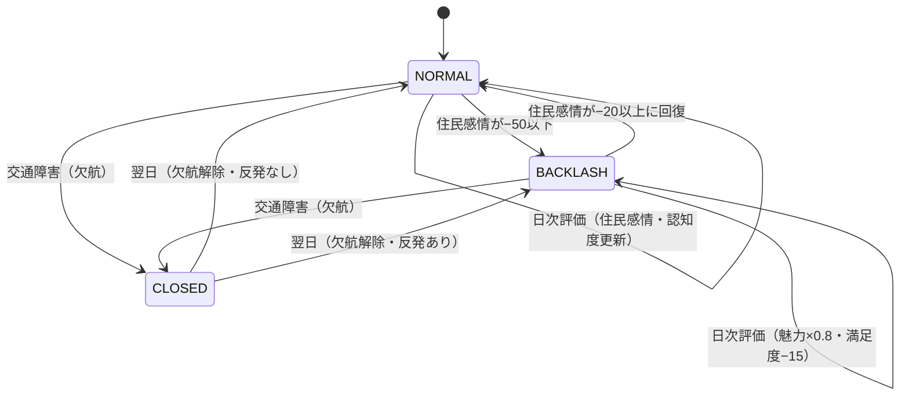
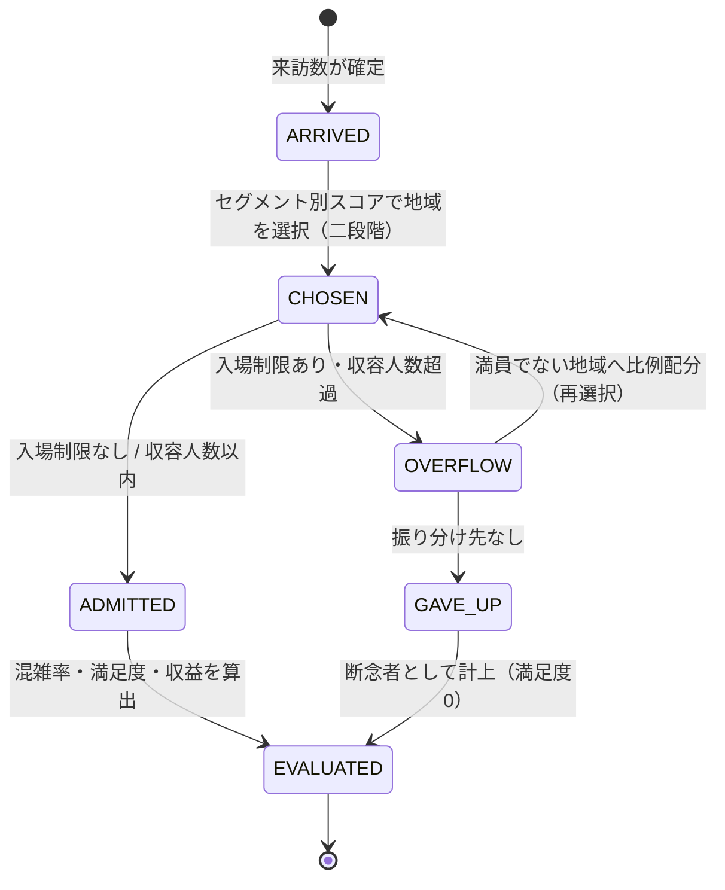
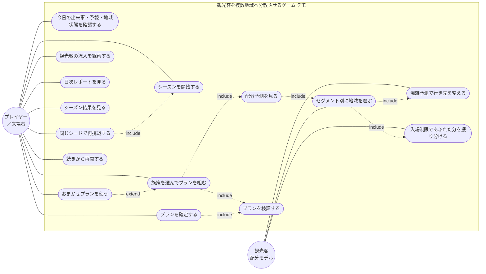

# 観光客を複数地域へ分散させるゲーム — デモ版 設計書

- リポジトリ名：`tourist-flow-balancer-demo`
- 対象エディション：デモ版（アイデアの視覚化）
- プラットフォーム：ゲーム（Unity WebGL、C#、PlayerPrefs、Unity Play）

---

## 1. 概要

### 1.1 課題

観光客は放っておくと知名度の高い1つの地域に集中し、その地域は過密（オーバーツーリズム）で満足度と住民感情を落とす一方、周辺地域は閑散として経済が回らない。プレイヤーは広域観光の調整役として、毎日「どの地域に、どの施策（プロモーション・クーポン・臨時バス・イベント・混雑情報の掲示・入場制限）を打つか」を予算の範囲で決める。観光客は施策と天候・話題性に反応して行き先を変える。プレイヤーの仕事は観光客を減らすことではなく、限られた予算で観光客の流れを複数地域へ「ちらす」設計をすることである。

### 1.2 デモ版の到達点

来場者が「シーズンを開始する → 何もしなければ中央観光地が過密になる予測を見る → 施策を選んで予測が変わるのを確認する → 確定して観光客が各地域へ流れるアニメーションを見る → 日次レポートで混雑率・満足度・住民感情を見る → 14日のシーズンが終わり、満足延べ人数と地域別の収支・過密日数が表示される → 同じシード（同じ天候・話題・来訪数）で施策を変えて再挑戦する」という一連の体験を、ブラウザ1つ・約5分で完結して行える展示物とする。

### 1.3 ターゲットとプラットフォームの選定理由

- 成果物を直接操作・閲覧するのは来場者（人間）であるため、人間向けプラットフォームから選定する。
- 課題で「ゲーム」が明示されているため、ゲームを選択し、プロジェクト方針どおり Unity WebGL（C#・PlayerPrefs・Unity Play）で構成する。
- 入力（施策の組み合わせ）に応じて観光客の配分と結果が変わる対話的な成果物であり、電子書籍・動画は不適である。
- サーバ・DB・外部通信を一切持たず、ブラウザ内で完結する。

### 1.4 デモ版の適用制約

| 項目 | 適用内容 |
|---|---|
| 実装方式 | 1 issueのワンショット実装 |
| 外部API | 一切使用しない。来訪数・天候・話題はゲーム内のシード付き乱数で生成する。地図データ・実在の地名・統計は使用しない |
| 認証 | 持たない |
| セッション | 初回ロード時にブラウザ内で不透明なオーナーIDを生成し、PlayerPrefsの全キーの接頭辞として付与する。他オーナーのデータは参照・操作しない |
| DB | 持たない。PlayerPrefs（ブラウザのローカルストレージ）のみ。毎日JST 03:00を境にページロード時に自動リセット（5.8節） |
| AI機能 | 観光客の行き先選択は決定的なルールベースの配分モデルである。学習・推論モデル・外部AI APIは使用しない |
| デザイン／測定／保守／監視 | なし（Unity既定のUIとプリミティブ図形で表示） |
| 個人情報 | 一切取得しない |
| Unity構成 | シーン・UI・オブジェクトはすべてコードで動的生成し、Unity EditorのGUI操作を前提としない。ビルドは `Unity.exe -batchmode -nographics -executeMethod` でCLI実行する |

---

## 2. 機能一覧

| ID | 機能 | 概要 |
|---|---|---|
| F1 | シーズン開始 | 新規シード、または直前のシードで14日のシーズンを開始する |
| F2 | 日次計画 | その日の施策を地域ごとに選び、予算内でプランを組む |
| F3 | 配分予測 | 現在のプランで観光客がどう配分されるかを、確定前に地域別の予測人数・混雑率として表示する |
| F4 | プラン検証 | 予算超過・閉鎖中地域への施策・逆効果になり得る施策をエラー／警告として表示する |
| F5 | おまかせプラン | 状況に応じた施策の組み合わせを自動で埋める（来場者が施策を選ばなくても成立させる） |
| F6 | 観光客の流入の観察 | 確定後、観光客が中央ハブから各地域へ移動し、地域が混雑度に応じて変化する様子を表示する |
| F7 | 今日の状況の確認 | 今日のカレンダー（平日／週末）・出来事（雨・SNSバズ・交通障害）・明日の出来事の予報、各地域の認知度・住民感情を表示する |
| F8 | 日次レポート | 地域別の来訪者数・混雑率・満足度・収益・住民感情の変化、断念者数を表示する |
| F9 | シーズン精算 | 満足延べ人数（スコア）、地域別の累計来訪者・収益・過密日数・閑散日数、住民感情の最終値、施策別の使用回数を表示する |
| F10 | 同じシードで再挑戦 | 直前のシーズンと同じカレンダー・出来事・来訪数の系列でシーズンを再開始する |
| F11 | 自動保存と復元 | 日の境界でゲーム状態を保存し、ページ再ロード時にその日の計画フェーズから復元する |
| F12 | 日次リセット | ページロード時にJST 03:00の境界を判定し、越えていれば保存データを消去する |

---

## 3. ゲームの世界と基本要素

### 3.1 地域

架空の広域観光圏に6つの地域がある。観光客は毎朝、中央ハブ（交通の起点）から1つの地域を選んで訪れ、夕方に帰る（宿泊・周遊は扱わない）。

| 地域 | 収容人数 | 基礎魅力 | 基礎認知度 | アクセス段数 | 特色タグ | 屋外型 | 客単価 |
|---|---|---|---|---|---|---|---|
| 中央観光地 | 450 | 90 | 100 | 1 | 歴史・グルメ | いいえ | 10 |
| 温泉郷 | 300 | 70 | 45 | 2 | 癒し・グルメ | いいえ | 14 |
| 港町 | 350 | 65 | 40 | 2 | グルメ・景観 | いいえ | 9 |
| 山里 | 200 | 60 | 25 | 3 | 自然・体験 | はい | 8 |
| 古街 | 250 | 70 | 35 | 2 | 歴史・景観 | いいえ | 9 |
| 離島 | 150 | 80 | 20 | 4 | 自然・景観 | はい | 12 |

- 収容人数は「快適に受け入れられる1日の人数」で、超えても入場できる（入場制限を掛けない限り）。
- アクセス段数は中央ハブからの遠さで、1が最も近い。臨時バスで一時的に1段短縮できる（下限1）。
- 認知度（5〜100）と住民感情（−100〜100）は日々変化する状態値である。初期の住民感情はすべて0。
- 総収容人数は1,700人であり、週末の来訪数（約1,800人）を上回らない。週末は全地域を快適に保つことができない設計であり、「どこにどれだけ我慢させるか」がプレイヤーの判断になる。

### 3.2 観光客セグメント

来訪する観光客は4つのセグメントに分かれ、地域の選び方が異なる。

| セグメント | 構成比 | 好むタグ | 遠さの嫌がり度 k | 価格感度 | 混雑回避 |
|---|---|---|---|---|---|
| 家族 | 30% | 体験・自然 | 0.25 | 高 | する |
| 若年 | 30% | グルメ・景観 | 0.10 | 高 | しない |
| シニア | 20% | 歴史・癒し | 0.40 | 低 | する |
| 訪日 | 20% | 歴史・景観 | 0.15 | 低 | しない |

- 「混雑回避する」セグメントは、混雑情報が掲示されている日に限り、混雑予測の高い地域を避ける。掲示がなければ混雑を知らずに向かう。
- セグメントは集計単位であり、個々の観光客を個別に扱わない。

### 3.3 来訪数とカレンダー

- 1シーズンは14日。6・7・13・14日目を週末とする。
- 基準来訪数は平日1,200人、週末は1.5倍の1,800人。雨の日は0.85倍。
- 実際の来訪数は基準に±10%の揺らぎ（シードから生成）を掛けた整数とする。配分予測（F3）は揺らぎを含まない基準来訪数で計算し、確定後の実績と一致しないことがある。

### 3.4 出来事

毎日1つの出来事がシードから決まる。今日の出来事は計画フェーズの開始時に公開し、明日の出来事も予報として公開する（予報は外れない）。

| 出来事 | 出現割合 | 効果 |
|---|---|---|
| 平常 | 55% | なし |
| 雨 | 20% | 来訪数×0.85。屋外型地域（山里・離島）の魅力×0.6 |
| SNSバズ | 15% | 中央観光地以外の1地域（シードで決定）の認知度を即時＋30 |
| 交通障害 | 10% | 中央観光地以外の1地域（シードで決定）のアクセス段数を当日＋2。対象が離島の場合は欠航として当日閉鎖（来訪0、選択肢から除外） |

### 3.5 施策（レバー）

| ID | 施策 | 対象 | 費用 | 効果 | 持続 |
|---|---|---|---|---|---|
| L1 | 混雑情報の掲示 | 全地域 | 20 | 混雑回避するセグメントが、混雑予測に応じて混雑地域を避ける | 当日のみ |
| L2 | クーポン | 1地域 | 30 | 価格感度が高いセグメントの選好×1.3、低いセグメント×1.1 | 当日のみ |
| L3 | プロモーション | 1地域 | 40 | 認知度を即時＋15（当日の配分から反映） | 認知度として残り、日々減衰 |
| L4 | 臨時バス | 1地域 | 50 | アクセス段数を当日−1（下限1） | 当日のみ |
| L5 | イベント開催 | 1地域 | 60 | 魅力×1.4。満足度＋5 | 当日のみ |
| L6 | 入場制限 | 1地域 | 0 | 来訪者を収容人数で打ち切り、あふれた人を他地域へ振り分ける。振り分け先がなければ「断念」となる | 当日のみ |

- 同じ施策を同じ地域に同じ日に2回以上掛けることはできない。
- 費用は「予算ポイント」で支払う。予算は毎日100ポイント支給され、使い残しは最大100ポイントまで翌日に繰り越す（所持上限200）。

### 3.6 満足度と住民感情

- 満足度（0〜100）は地域ごとに毎日算出する。混雑率が0.9を超えると下がり始め、1.2を超えると急落する。
- 住民感情（−100〜100）は混雑率に応じて日々増減する。−50以下で「反発」状態になり、魅力が2割下がる。−20以上に回復するまで反発は解けない（ヒステリシス）。
- 閑散（混雑率0.3未満）も住民感情をわずかに下げる。放置された地域は「経済が回らない」ことを表す。

### 3.7 スコア

- 日ごとの「満足延べ人数」＝各地域の来訪者数×満足度÷100の合計（整数化）。
- 「断念者」＝入場制限であふれ、行き先がなかった人数。
- シーズンスコア＝満足延べ人数の14日合計 − 断念者の14日合計。
- スコアに加えて、地域別の過密日数（混雑率1.2超）・閑散日数（0.3未満）・累計収益・住民感情の最終値を精算画面で示す。

---

## 4. 配分モデル仕様

### 4.1 セグメント別スコア

セグメントsが地域rを選ぶ度合い（スコア）は、以下の積とする。閉鎖中の地域はスコアを持たない（候補から除外）。

| 要素 | 定義 |
|---|---|
| 魅力 | 基礎魅力 × 出来事補正（雨×0.6は屋外型のみ）× イベント補正（開催なら1.4）× 反発補正（反発状態なら0.8） |
| タグ一致 | 1.0 ＋ 0.3 ×（セグメントの好むタグと地域の特色タグの一致数。0・1・2） |
| 認知度係数 | 認知度÷100（下限0.1） |
| アクセス係数 | 1 ÷（1 ＋ k ×（実効アクセス段数−1））。実効段数＝基礎段数＋交通障害の加算−臨時バスの短縮、下限1 |
| 価格係数 | クーポンあり：価格感度高1.3／低1.1。なし：1.0 |
| 混雑回避係数 | 混雑情報の掲示があり、かつ混雑回避するセグメントのとき、混雑予測c（4.3節）に対し 1 −（c − 0.9）を0.4〜1.0に収めた値。掲示なし、または回避しないセグメントは1.0 |

混雑回避係数は連続関数とし、閾値の前後で不連続に変化させない。不連続な係数は、別の施策の小さな変化で予測が大きく跳ぶ挙動を生む。

### 4.2 シェアと人数

- セグメントsの各地域のシェア＝その地域のスコア÷候補地域のスコア合計。
- セグメントsの地域rへの人数＝来訪数×セグメント構成比×シェア。
- 地域ごとの人数は、セグメントの合計を最大剰余法で整数化し、合計が来訪数と一致するようにする。

### 4.3 二段階計算（混雑予測）

混雑情報の掲示がある日は、配分を二段階で計算する。

1. 一段階目：混雑回避係数をすべて1.0として配分し、地域別の混雑率を「混雑予測」とする。
2. 二段階目：混雑予測から混雑回避係数を求め、配分をやり直す。二段階目の結果を最終配分とする。

混雑予測は「その日の計画に基づく予測」であり、前日の実績は用いない。前日実績を用いると「混んだ翌日は空き、空いた翌日は混む」振動が起きる。

### 4.4 入場制限の振り分け（ウォーターフォール）

1. 入場制限が掛かった地域のうち、人数が収容人数を超えるものについて、超過分をあふれとして集め、その地域の人数を収容人数に固定し「満員」と印を付ける。
2. あふれの合計を、満員でも閉鎖でもない地域へ、その時点の人数に比例して上乗せする。
3. 上乗せの結果、入場制限のある別の地域が収容人数を超えたら、手順1に戻る。満員の地域は候補に戻さないため、繰り返しは最大でも地域数（6回）で終わる。
4. 振り分け先が1つもない（候補地域が空）場合、残ったあふれを「断念者」として計上する。

入場制限のない地域は収容人数を超えて受け入れる（過密になる）。振り分け先が過密になることは制限しない。

---

## 5. ロジック仕様

すべてルールベースで、外部との通信を持たない。数値定数は5.10節にまとめる。

### 5.1 関数A：シーズン初期化（initSeason）

**入力**：シード（新規の場合は現在時刻から生成、再挑戦の場合は直前のシード）。

**出力**：シーズン状態（日＝1、地域6件の状態値、予算100、出来事表14日分、来訪数表14日分、集計値）。

**手順**

1. シードから3つの独立した乱数系列を作る。系列E（出来事の種類）、系列T（出来事の対象地域）、系列N（来訪数の揺らぎ）。系列を分けることで、施策の内容が出来事や来訪数に影響しない。
2. 系列E・Tで14日分の出来事（種類と対象地域）を生成する。
3. 系列Nで14日分の来訪数を生成する（3.3節の基準×揺らぎ、整数）。
4. 全地域の認知度を基礎認知度、住民感情を0、反発状態を「なし」で初期化する。
5. 予算を100、集計値を0で初期化する。
6. 1日目の出来事と2日目の予報を公開し、SNSバズなら対象地域の認知度に＋30を適用する。
7. 空のプランを用意し、ゲーム状態を「計画中」とする。

### 5.2 関数B：プラン検証（validatePlan）

**入力**：プラン（施策と対象地域の集合）、シーズン状態（予算・閉鎖地域）、現在のプランでの配分予測（関数C）。

**出力**：エラー・警告の一覧、確定可否。

**手順**

1. 施策費用の合計が予算を超えていればエラー。
2. 同じ施策・同じ地域の組が重複していればエラー。
3. 閉鎖中（欠航）の地域を対象とする施策があれば警告（費用は掛かるが効果がない）。
4. 配分予測で混雑率が1.0を超える地域に、クーポン・プロモーション・臨時バス・イベントのいずれかが掛かっていれば警告（混雑を強める施策）。
5. 配分予測で混雑率が1.2を超える地域があり、かつ混雑情報の掲示も入場制限もない場合は助言（過密が見込まれる）。
6. 入場制限が全地域に掛かっており、かつ来訪数が総収容人数を超える見込みなら助言（断念者が出る）。
7. エラーが1つ以上あれば確定不可を返す。警告・助言は確定を妨げない。

### 5.3 関数C：配分計算（allocateVisitors）

**入力**：来訪数、プラン、シーズン状態（各地域の認知度・反発・閉鎖・アクセス）、今日の出来事。

**出力**：地域別の来訪者数、断念者数、混雑予測（掲示があるとき）。

**手順**

1. 閉鎖中の地域を候補から外す。候補が空なら全員を断念者として返す（現行の出来事定義では起きないが、境界として定義する）。
2. 各セグメント・各候補地域のスコアを4.1節で求める（混雑回避係数はすべて1.0）。
3. 4.2節でシェアと人数を求め、地域ごとに合計する。これを一段階目の結果とする。
4. 混雑情報の掲示がなければ、一段階目の結果を配分とする。掲示があれば、一段階目の混雑率を混雑予測として混雑回避係数を求め、手順2〜3をやり直し、二段階目の結果を配分とする。
5. 最大剰余法で整数化し、合計が来訪数と一致することを確認する。
6. 入場制限があれば4.4節のウォーターフォールを適用し、地域別人数と断念者数を確定する。
7. 地域別人数・断念者数・混雑予測を返す。

配分予測（F3）は、来訪数に基準来訪数（揺らぎなし）を渡して同じ関数を呼ぶ。確定時は実際の来訪数を渡す。同じ関数を用いることで、予測と実績の差が来訪数の揺らぎだけに限定される。

### 5.4 関数D：日次評価（evaluateDay）

**入力**：地域別来訪者数、断念者数、プラン、シーズン状態。

**出力**：地域別の混雑率・満足度・収益、住民感情の変化、満足延べ人数、日次レポート。

**手順**（地域を番号順に処理する）

1. 混雑率c＝来訪者数÷収容人数。閉鎖中の地域はc＝0、満足度・収益は算出しない。
2. 混雑ペナルティ：c≦0.9なら0。0.9＜c≦1.2なら（c−0.9）×100。c＞1.2なら30＋（c−1.2）×100、上限60。
3. 満足度＝60＋（実効魅力−60）÷2＋イベント補正（開催なら＋5）−混雑ペナルティ−反発ペナルティ（反発状態なら15）−閑散ペナルティ（c＜0.3なら5）。0〜100に収める。実効魅力は4.1節の魅力（出来事・イベント・反発補正込み）。
4. 収益＝来訪者数×客単価×（0.5＋満足度÷200）。整数化。
5. 住民感情の変化：c＞1.2なら−15。1.0＜c≦1.2なら−6。0.3≦c≦1.0なら＋3。c＜0.3なら−2。閉鎖中は0。−100〜100に収める。
6. 反発状態の更新：住民感情が−50以下になったら「反発」。反発中に−20以上に戻ったら解除。
7. 認知度の口コミ変化：来訪者数100人ごとに、満足度60以上なら＋1、40未満なら−1、それ以外は0。
8. 満足延べ人数＝Σ（来訪者数×満足度÷100）の整数化。
9. 過密日数（c＞1.2）・閑散日数（c＜0.3）・累計来訪者・累計収益・施策使用回数を集計値に加える。断念者を累計に加える。
10. 日次レポートを生成する。

### 5.5 関数E：日次更新（advanceDay）

確定した日の評価（関数D）の後、以下を**この順で**実行する。順序を固定することで、口コミと減衰の適用順で認知度がぶれる・翌日の出来事が当日の配分に混じるといった不整合を防ぐ。

1. **認知度の減衰**：各地域の認知度を基礎認知度に向けて3だけ近づける（基礎より上なら−3、下なら＋3、差が3未満なら基礎に一致）。プロモーション・SNSバズで上げた認知度はこの減衰で日々戻る。口コミによる変化は関数Dで先に適用済みである。
2. **認知度の範囲**：5〜100に収める。
3. **予算の繰越**：使い残しを最大100まで残し、100を加える（所持上限200）。
4. **当日限りの効果の解除**：クーポン・臨時バス・イベント・混雑情報・入場制限・交通障害の加算・欠航を解除する。
5. **シーズン終了判定**：今日が14日目なら関数Fへ進む。
6. **翌日の公開**：日を1進め、出来事と翌々日の予報を公開する。最終日の予報は「なし」とする。SNSバズなら対象地域の認知度に＋30を適用し、5〜100に収める。交通障害なら対象地域のアクセス加算または欠航を設定する。
7. **プランの初期化**：空のプランを用意し、ゲーム状態を「計画中」とする。
8. **自動保存**：関数Gで状態を保存する。

### 5.6 関数F：シーズン精算（finalizeSeason）

1. スコア＝満足延べ人数の累計−断念者の累計。
2. 地域別の累計来訪者・累計収益・過密日数・閑散日数・住民感情の最終値、施策別の使用回数、断念者の累計を集計する。
3. ベストスコアより高ければベストスコアを更新する。
4. シードを「直前のシード」として保存し、「同じシードで再挑戦」を選べるようにする。
5. ゲーム状態を「精算」とし、進行中の保存データを削除する。

### 5.7 関数H：おまかせプラン（autoPlan）

**入力**：シーズン状態、今日の出来事、予算。

**出力**：プラン。

**手順**（予算が尽きた時点で打ち切る。各手順は施策を1つ追加するごとに配分予測を再計算する）

1. 空のプランで配分予測を計算する。
2. 混雑率1.2超の地域があれば、混雑情報の掲示を追加する。
3. 混雑率1.5超の地域があれば、その地域に入場制限を追加する（費用0）。
4. 混雑率0.5未満かつ閉鎖中でない地域のうち認知度が最も低い地域に、プロモーションを追加する。同率なら地域番号の小さいものを選ぶ。
5. 予算が50以上残っていれば、混雑率0.5未満の地域のうちアクセス段数が最も大きい地域に臨時バスを追加する。
6. 予算が30以上残っていれば、混雑率0.5未満の地域のうち収容人数が最も大きい地域にクーポンを追加する。
7. プランを関数Bで検証し、エラーがあれば最後に追加した施策から順に外す。

おまかせプランは来場者が施策を選ばなくても成立させるためのものであり、最善手ではない。プランはプレイヤーが編集できる。

### 5.8 関数G：保存と日次リセット（persist / resetIfNeeded）

**リセット判定（ページロード時）**

1. PlayerPrefsからオーナーIDを読む。なければ生成して保存する。
2. 「前回リセット日時」を読む。現在時刻（JST）に対し直近のJST 03:00より前であれば、オーナーID以外の全キーを削除し、前回リセット日時を現在時刻で更新する。
3. 削除後はタイトル画面を表示する。

**保存**

- 関数Eの手順8で、シーズン状態（日・地域状態値・予算・出来事表・来訪数表・集計値・ベストスコア）を1つのJSON文字列としてPlayerPrefsに保存する。
- シーズン精算時にも保存する。
- 編集中のプランは保存しない（復元時は空のプランから始める）。
- 保存キーはすべてオーナーIDを接頭辞に持つ。

**復元**

- ページロード時、リセット判定を通過したのち、進行中のシーズンがあれば「続きから」を選べる。復元は保存時点（その日の計画フェーズ・空のプラン）から始まり、確定後・アニメーション中の状態は復元しない。

### 5.9 進行と一時停止

- 計画中は時間が進まない。確定操作で「流入中」に移り、観光客の移動アニメーション（等速約8秒、スキップ可）を経て日次レポートを表示する。
- レポートを閉じると関数Eが実行され、翌日の計画中に戻る。
- 入力は計画中のみ受け付ける。流入中・レポート表示中はプランを変更できない。

### 5.10 定数一覧（デモ版の既定値）

| 定数 | 値 | 用途 |
|---|---|---|
| 地域数 | 6 | 関数A |
| シーズン日数 | 14 | 関数E・F |
| 週末 | 6・7・13・14日目 | 関数A |
| 基準来訪数 | 平日1,200／週末1,800 | 関数A・C |
| 雨の来訪数補正 | ×0.85 | 関数C |
| 来訪数の揺らぎ | ±10% | 関数A |
| 出来事の出現割合 | 平常55／雨20／SNSバズ15／交通障害10（%） | 関数A |
| SNSバズの認知度加算 | ＋30 | 関数A・E |
| 交通障害のアクセス加算 | ＋2（離島は欠航） | 関数E |
| 雨の屋外魅力補正 | ×0.6 | 関数C |
| タグ一致の加算 | 0.3／一致 | 関数C |
| 認知度係数の下限 | 0.1 | 関数C |
| 混雑回避係数 | 1−（c−0.9）を0.4〜1.0に収める | 関数C |
| クーポンの価格係数 | 高1.3／低1.1 | 関数C |
| プロモーションの認知度加算 | ＋15 | 関数C |
| イベントの魅力補正 | ×1.4、満足度＋5 | 関数C・D |
| 反発の魅力補正 | ×0.8、満足度−15 | 関数C・D |
| 施策費用 | 掲示20／クーポン30／プロモ40／バス50／イベント60／入場制限0 | 関数B |
| 日次予算・繰越上限・所持上限 | 100／100／200 | 関数E |
| 混雑ペナルティの閾値 | 0.9・1.2、上限60 | 関数D |
| 閑散の閾値 | 0.3 | 関数D |
| 住民感情の変化 | −15／−6／＋3／−2 | 関数D |
| 反発の入り・解除 | −50以下／−20以上 | 関数D |
| 口コミの認知度変化 | 100人ごとに±1 | 関数D |
| 認知度の減衰 | 3／日（基礎へ） | 関数E |
| 認知度の範囲 | 5〜100 | 関数E |
| 収益係数 | 0.5＋満足度÷200 | 関数D |
| 流入アニメーション | 約8秒（スキップ可） | 進行 |

---

## 6. データ仕様

- DBは持たず、PlayerPrefsに以下のキーを保存する。キーはすべて「オーナーID:」を接頭辞に持つ。
- 構造を持つ値はJSON文字列として1キーに保存する。
- 個人を特定できる項目は持たない。

| キー | 型 | 内容 |
|---|---|---|
| owner_id | 文字列 | 不透明なオーナーID（接頭辞なしで保存する唯一のキー） |
| last_reset_at | 文字列 | 前回リセット日時（ISO 8601、JST） |
| season | JSON | 進行中のシーズン状態（下表） |
| last_seed | 整数 | 直前のシーズンのシード |
| best_score | 整数 | ベストスコア |

シーズン状態（season）の構成

| 要素 | 主な項目 |
|---|---|
| Season | シード、日、予算、状態（計画中／流入中／レポート／精算）、開始日時 |
| RegionState（6件） | 地域ID、認知度、住民感情、反発状態、当日のアクセス加算、閉鎖 |
| EventDay（14件） | 日、出来事の種類、対象地域ID |
| ArrivalDay（14件） | 日、来訪数 |
| Stats | 満足延べ人数の累計、断念者の累計、地域別の累計来訪者・累計収益・過密日数・閑散日数、施策別の使用回数 |

地域マスタ（Region）とセグメントマスタ（Segment）はコード内の定数であり、保存しない。

---

## 7. ER図

DBは存在しないため、PlayerPrefsに保存するJSONとコード内マスタの論理構造を示す。



---

## 8. DFD



---

## 9. シーケンス図

### 9.1 1日の計画から確定まで



### 9.2 日次更新とシーズン終了



### 9.3 ページロード時の復元と日次リセット



---

## 10. クラス図



---

## 11. 状態遷移図

### 11.1 ゲーム全体



補足規則

- PLANNINGでは時間が進まず、施策の変更ごとに配分予測と検証を再計算する。
- INFLOW・REPORTではプランを変更できない。
- 保存はREPORTからPLANNINGへ移る際（関数E）に行う。INFLOW・REPORT中に再ロードされた場合、その日は確定前（PLANNING・空のプラン）に戻る。

### 11.2 地域



補足規則

- 欠航は当日限りで、翌日は欠航前の状態（通常または反発）に戻る。閉鎖中は住民感情・口コミを変化させない。
- 反発の入り（−50以下）と解除（−20以上）に幅を持たせ、境界付近で毎日入れ替わることを防ぐ。

### 11.3 1日の観光客の流れ



---

## 12. ユースケース図



---

## 13. 画面構成

| 画面 | 内容 |
|---|---|
| タイトル | 新規開始／同じシードで再挑戦（直前シードがあるとき）／続きから（進行中データがあるとき）。ベストスコアとシード値を表示 |
| 計画（地図） | 中央ハブと6地域をノードで配置した簡易地図。各地域に「予測人数／収容人数」「混雑率」「認知度」「住民感情」を数値と記号で表示。上部に日・平日／週末・今日の出来事・明日の予報・予算。右側に施策パネル（施策×地域の選択、費用、現在の合計、検証結果）。下部に「おまかせ」「確定」 |
| 流入 | ハブから各地域へ人数に比例した数の点が移動する。到着した地域は混雑率に応じて枠の太さと記号（快適「○」、混雑「△」、過密「×」、閑散「…」、閉鎖「休」）を更新する。「スキップ」ボタン |
| 日次レポート | 地域別の来訪者数・混雑率・満足度・収益・住民感情の変化、断念者数、今日の満足延べ人数。予測と実績の差（来訪数の揺らぎ）を併記 |
| シーズン結果 | スコア（満足延べ人数−断念者）、地域別の累計来訪者・累計収益・過密日数・閑散日数・住民感情の最終値、施策別の使用回数、シード値、「同じシードで再挑戦」「タイトルへ」 |

- 色のみで意味を区別せず、混雑度は記号と数値を併記する。
- 予測は施策の変更ごとに即時に更新し、「施策を打つと予測がどう変わるか」を来場者が試行錯誤できるようにする。

---

## 14. 非機能要件と制約

### 14.1 ロジックの設計原則

- 配分は**同一の関数**で予測と実績を計算し、両者の差を来訪数の揺らぎだけに限定する。
- 混雑回避は**同日の計画に基づく二段階計算**で求め、前日実績を用いない。
- 配分に用いる係数は**連続関数**とし、閾値の前後で不連続に変化させない。
- 入場制限のあふれは**満員地域を候補から外しながら**振り分け、振り分け先がなければ断念者として計上する。繰り返しは地域数を上限とする。
- 人数の整数化は**最大剰余法**で行い、地域別人数の合計を来訪数に一致させる。
- 日次更新は「評価（住民感情・口コミ）→認知度減衰→予算繰越→当日効果解除→翌日公開→保存」の固定順で行う。
- 乱数は出来事の種類・対象地域・来訪数の3系列に分離する。これにより同一シードは同一の出来事と来訪数を再現し、施策の違いだけが結果の違いになる。
- 反発状態の入りと解除に幅（ヒステリシス）を持たせ、境界付近での毎日の入れ替わりを防ぐ。
- 施策の変更は計画中のみ受け付け、確定後は当日の配分を変更しない。

### 14.2 ゲームとしての設計原則

- 何も施策を打たないと中央観光地が平日でも過密（混雑率1.3程度）、週末は2倍に達する初期バランスとし、課題が最初の予測画面で見える。
- 週末の来訪数が総収容人数を上回るため、「すべてを快適にする」解は存在せず、どこに我慢させるか・断念者を出すかの判断が残る。
- 小さな地域（離島・山里）へ強く誘導すると今度はそこが過密になるバランスとし、「分散＝一方向の誘導ではない」ことを体験させる。
- 施策の効果を予測画面で即時に見せ、確定前に試行錯誤できるようにする。失敗は資金ではなく、住民感情の低下・過密日数・断念者として現れ、結果画面で原因を辿れる。
- 同じシードでの再挑戦を用意し、施策の違いだけが結果の違いになる比較を可能にする。
- おまかせプランだけで完走できる難易度とし、施策を1つも選ばない来場者にも成立する。

### 14.3 Unity実装の原則

- シーン・UI・地図・観光客の点はすべて起動時にコードで生成する。Prefab・シーンファイルの手作業編集を前提としない。
- 表示はプリミティブ（Quad・Circle相当のスプライトをコード生成）とuGUIの既定フォントのみを用いる。
- 地図は架空の配置であり、実在の地図データ・地名を用いない。
- データ保存はPlayerPrefsのみ。WebGLではブラウザのIndexedDBに保存されるため、書き込み後に明示的に保存を確定する。
- ビルドは `Unity.exe -batchmode -nographics -executeMethod BuildScript.BuildWebGL` でCLI実行する。
- Unity Playへのアップロードのみ人間が手動で行う。
- 外部通信（Unity Analytics・広告・ランキング等）を一切含めない。

### 14.4 日次リセット

- ページロード時に「前回リセット日時」を確認し、直近のJST 03:00より前であればオーナーID以外の全キーを削除する。
- プレイ中に日付境界を越えてもプレイは中断せず、次のページロード時にリセットする。

### 14.5 リポジトリ構成

```
tourist-flow-balancer-demo/
├── Assets/
│   ├── Scripts/
│   │   ├── Core/          # Season・Region・RegionState・Segment・EventDay・Plan・Measure
│   │   ├── Logic/         # Allocator・DayEvaluator・DayAdvancer・SeasonFinalizer・PlanValidator・AutoPlanner
│   │   ├── Infra/         # Persistence・SplitRng・GameFlow
│   │   ├── UI/            # UIPresenter・各画面の動的生成
│   │   └── Bootstrap/     # GameBootstrap（シーン・UI生成）
│   └── Editor/
│       └── BuildScript.cs # CLIビルド用
├── ProjectSettings/
├── docs/
│   └── spec.md            # 本書
└── README.md
```

---

## 15. 用語

| 用語 | 定義 |
|---|---|
| 地域 | 観光客の行き先となる6つの架空の観光地。収容人数・魅力・認知度・アクセス・特色タグを持つ |
| 中央ハブ | 観光客が毎朝出発する交通の起点。地域ではなく、来訪先にはならない |
| セグメント | 地域の選び方が異なる観光客の集計単位（家族・若年・シニア・訪日） |
| 施策（レバー） | プレイヤーが予算で打つ6種の手段。混雑情報の掲示・クーポン・プロモーション・臨時バス・イベント・入場制限 |
| プラン | ある日に打つ施策と対象地域の集合 |
| 配分 | 来訪数をセグメント別スコアに基づいて地域へ振り分けた結果 |
| 混雑予測 | 混雑回避係数をすべて1.0として計算した一段階目の混雑率。混雑情報の掲示で観光客が参照する |
| 混雑率 | 来訪者数÷収容人数。0.9を超えると満足度が下がり、1.2を超えると過密 |
| 過密日／閑散日 | 混雑率が1.2を超えた地域・日／0.3未満の地域・日 |
| 断念者 | 入場制限であふれ、振り分け先がなかった観光客。スコアから差し引く |
| 住民感情 | 地域の住民の受け止め（−100〜100）。混雑で下がり、適度な来訪で回復する |
| 反発 | 住民感情が−50以下で入る状態。魅力が2割下がり、−20以上で解除される |
| 認知度 | 観光客がその地域を知っている度合い（5〜100）。プロモーション・SNSバズ・口コミで動き、基礎値へ減衰する |
| 満足延べ人数 | 来訪者数×満足度÷100の合計。シーズンスコアの基礎 |
| シード | 出来事・対象地域・来訪数の乱数系列を決める整数。同じシードは同じ環境を再現する |
| オーナーID | ブラウザ内で生成する不透明な識別子。PlayerPrefsの全キーの接頭辞 |
